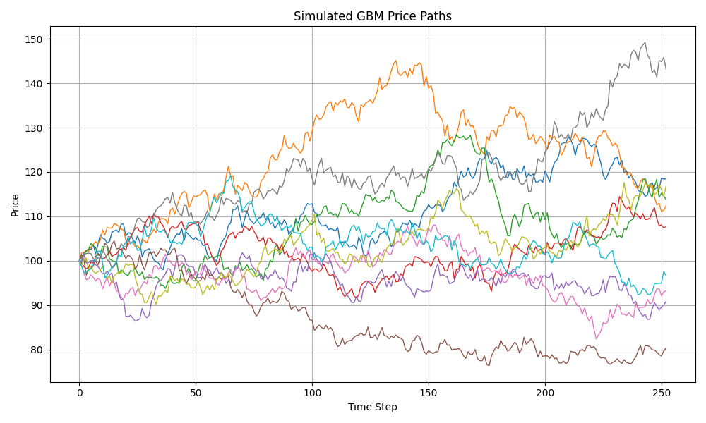

# Monte Carlo Option Pricing Simulator

This project simulates European call/put option prices using:
- Geometric Brownian Motion (GBM)
- Monte Carlo methods
- Black-Scholes comparison

## Features
- Simulates 1000s of asset paths
- Calculates expected payoff and discounted option price
- Visualizes sample trajectories and distributions

## Requirements
- Python 3.x
- NumPy, Matplotlib, Jupyter

## Example Output

## Author
Rayyan Mirza
